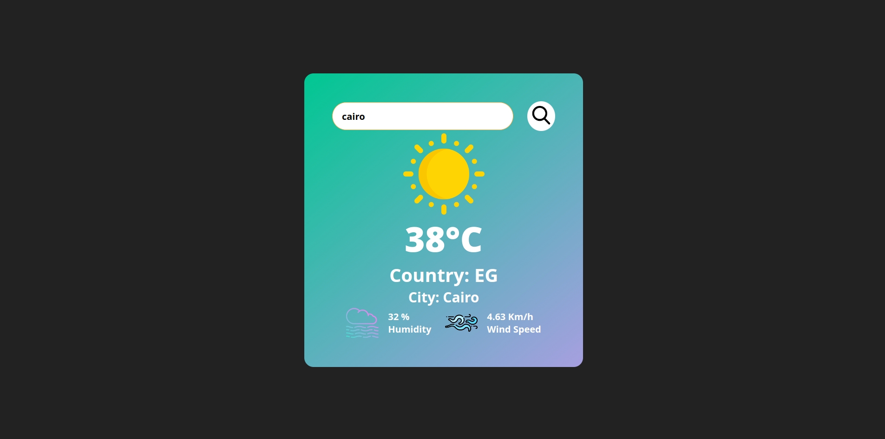
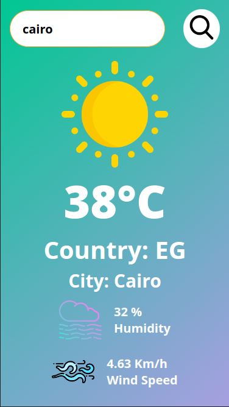

<h1>Weather_App_v1.0</h1>
<h2>By searching for any city, the weather app will provide the temperature, relative humidity, wind speed, and the name of the country where the city is located.</h2>
<h3>Live Demo: https://mohamed-0-turki.github.io/Weather_App_v1.0/</h3>
<h4>The API was used from the https://openweathermap.org/</h4>
<h5>Project design</h5>

